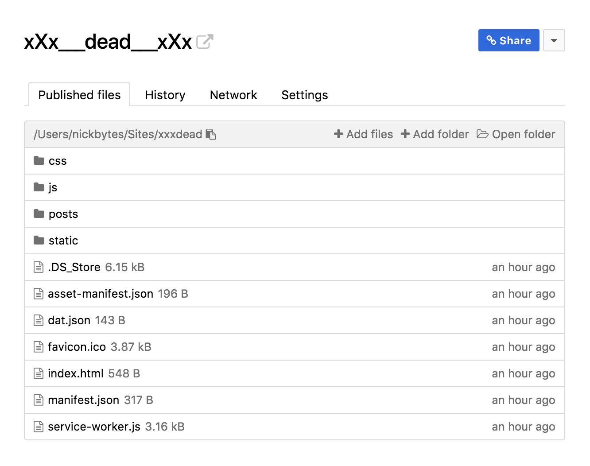

# xXx\_\_\_dead\_\_\_xXx


_Wot?_

### Development

⚠️ WIP THIS WON'T WORK YET ⚠️

1.  Clone the repo.
2.  Install dependencies

```bash
yarn install
```

3.  Start the development server

```bash
yarn start
```

4.  Okay, it's going to get a little weird here.
5.  Create a new Dat site in your Beaker Browser library.
6.  Add your Dat url to config.js
7.  Replace the contents of `dat.json` with your new `dat.json` (Not sure this is completely necessary)
8.  Run a build

```bash
yarn run build
```

9.  Add the contents from your `/build` folder to your new site's library.
10. The output should look something like this:



11. You should be able to navigate to your localhost address now, and still pull posts/data from your dat site.
